#### Kaggle | Intro to Machine Learning

# 1) How Models Work

We use data to decide how to break the houses into two groups, and then again to determine the predicted price in each group. This step of capturing patterns from data is called fitting or training the model. The data used to fit the model is called the training data. 

# 2) Basic Data Exploration 

```python
# save filepath to variable for easier access 
melbourne_file_path = '../input/melbourne-housing-snapshot/melb_data.csv' 
# read the data and store data in DataFrame titled melbourne_data 
melbourne_data = pd.read_csv(melbourne_file_path)  
# print a summary of the data in Melbourne data 
melbourne_data.describe()
```

## Interpreting Data Description 

The results show 8 numbers for each column in your original dataset. The first number, the count, shows how many rows have non-missing values. 

Missing values arise for many reasons. For example, the size of the 2nd bedroom wouldn't be collected when surveying a 1 bedroom house. We'll come back to the topic of missing data. 

The second value is the mean, which is the average. Under that, std is the standard deviation, which measures how numerically spread out the values are. 

To interpret the min, 25%, 50%, 75% and max values, imagine sorting each column from lowest to highest value. The first (smallest) value is the min. If you go a quarter way through the list, you'll find a number that is bigger than 25% of the ve point at the bottom where we make a prediction is called a leaf alues and smaller than 75% of the values. That is the 25% value (pronounced "25th percentile"). The 50th and 75th percentiles are defined analogously, and the max is the largest number 

# 3) Your First Machine Learning Model

To choose variables/columns, we'll need to see a list of all columns in the dataset. That is done with the columns property of the DataFrame (the bottom line of code below). 

```python
melbourne_file_path = '../input/melbourne-housing-snapshot/melb_data.csv' 
melbourne_data = pd.read_csv(melbourne_file_path)  
melbourne_data.columns 
_____________________ 
 

# The Melbourne data has some missing values (some houses for which some variables weren't recorded.) 
# We'll learn to handle missing values in a later tutorial.   
# Your Iowa data doesn't have missing values in the columns you use.  
# So we will take the simplest option for now, and drop houses from our data.  
# Don't worry about this much for now, though the code is: 

# dropna drops missing values (think of na as "not available") 
melbourne_data = melbourne_data.dropna(axis=0) 
```


## Selecting The Prediction Target 

You can pull out a variable with dot-notation. This single column is stored in a Series, which is broadly like a DataFrame with only a single column of data. 

We'll use the dot notation to select the column we want to predict, which is called the prediction target. By convention, the prediction target is called y. So the code we need to save the house prices in the Melbourne data is 


## Choosing "Features"

The columns that are inputted into our model (and later used to make predictions) are called "features." In our case, those would be the columns used to determine the home price. Sometimes, you will use all columns except the target as features. Other times you'll be better off with fewer features. 

For now, we'll build a model with only a few features. Later on you'll see how to iterate and compare models built with different features. 

We select multiple features by providing a list of column names inside brackets. Each item in that list should be a string (with quotes). 

Here is an example: 


By convention, this data is called X. 

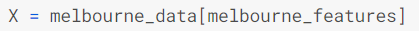

Let's quickly review the data we'll be using to predict house prices using the describe method and the head method, which shows the top few rows. 

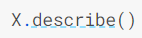


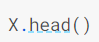


## Building Your Model

You will use the scikit-learn library to create your models. When coding, this library is written as sklearn, as you will see in the sample code. Scikit-learn is easily the most popular library for modeling the types of data typically stored in DataFrames. 

The steps to building and using a model are: 

- Define: What type of model will it be? A decision tree? Some other type of model? Some other parameters of the model type are specified too. 
- Fit: Capture patterns from provided data. This is the heart of modeling. 
- Predict: Just what it sounds like 
- Evaluate: Determine how accurate the model's predictions are. 

Here is an example of defining a decision tree model with scikit-learn and fitting it with the features and target variable. 


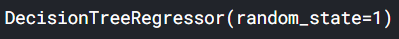

Many machine learning models allow some randomness in model training. Specifying a number for random_state ensures you get the same results in each run. This is considered a good practice. You use any number, and model quality won't depend meaningfully on exactly what value you choose. 

We now have a fitted model that we can use to make predictions. 

In practice, you'll want to make predictions for new houses coming on the market rather than the houses we already have prices for. But we'll make predictions for the first few rows of the training data to see how the predict function works 

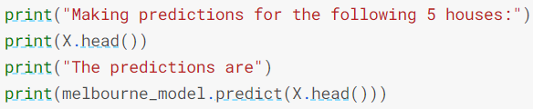


# 4) Model Validation

You'll want to evaluate almost every model you ever build. In most (though not all) applications, the relevant measure of model quality is predictive accuracy. In other words, will the model's predictions be close to what actually happens. 

Many people make a huge mistake when measuring predictive accuracy. They make predictions with their training data and compare those predictions to the target values in the training data. You'll see the problem with this approach and how to solve it in a moment, but let's think about how we'd do this first. 

You'd first need to summarize the model quality into an understandable way. If you compare predicted and actual home values for 10,000 houses, you'll likely find mix of good and bad predictions. Looking through a list of 10,000 predicted and actual values would be pointless. We need to summarize this into a single metric. 

There are many metrics for summarizing model quality, but we'll start with one called Mean Absolute Error (also called MAE). Let's break down this metric starting with the last word, error. 

The prediction error for each house is: 

`error=actual−predicted`

So, if a house cost $150,000 and you predicted it would cost $100,000 the error is $50,000. 

With the MAE metric, we take the absolute value of each error. This converts each error to a positive number. We then take the average of those absolute errors. This is our measure of model quality. In plain English, it can be said as 

On average, our predictions are off by about X. 

To calculate MAE, we first need a model.  

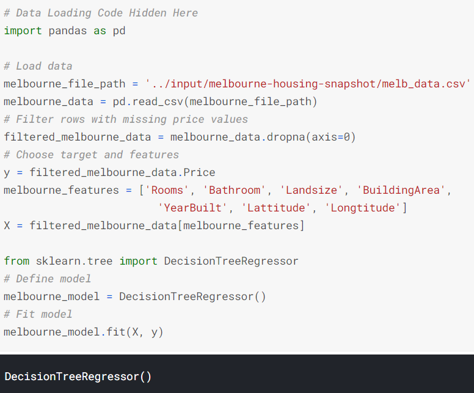

Once we have a model, here is how we calculate the mean absolute error: 

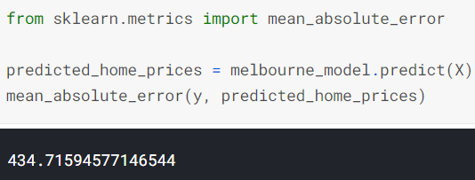

## The Problem with "In-Sample" Scores

The measure we just computed can be called an "in-sample" score. We used a single "sample" of houses for both building the model and evaluating it. Here's why this is bad. 

Imagine that, in the large real estate market, door color is unrelated to home price. 

However, in the sample of data you used to build the model, all homes with green doors were very expensive. The model's job is to find patterns that predict home prices, so it will see this pattern, and it will always predict high prices for homes with green doors. 

Since this pattern was derived from the training data, the model will appear accurate in the training data. 

But if this pattern doesn't hold when the model sees new data, the model would be very inaccurate when used in practice. 

Since models' practical value come from making predictions on new data, we measure performance on data that wasn't used to build the model. The most straightforward way to do this is to exclude some data from the model-building process, and then use those to test the model's accuracy on data it hasn't seen before. This data is called validation data. 

## Coding It 

The scikit-learn library has a function train_test_split to break up the data into two pieces. We'll use some of that data as training data to fit the model, and we'll use the other data as validation data to calculate mean_absolute_error. 

Here is the code: 
_Recall that features are loaded in X and your target is loaded in Y_

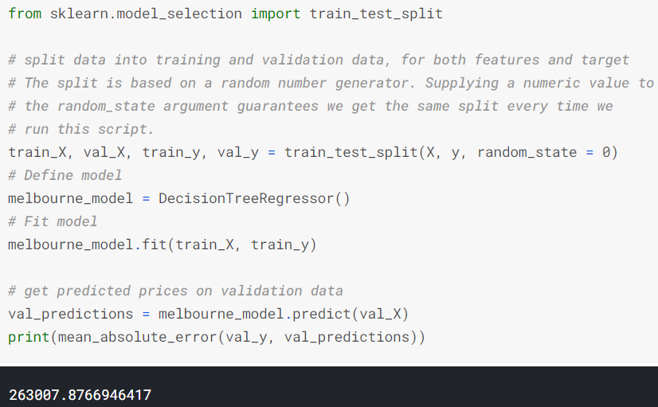

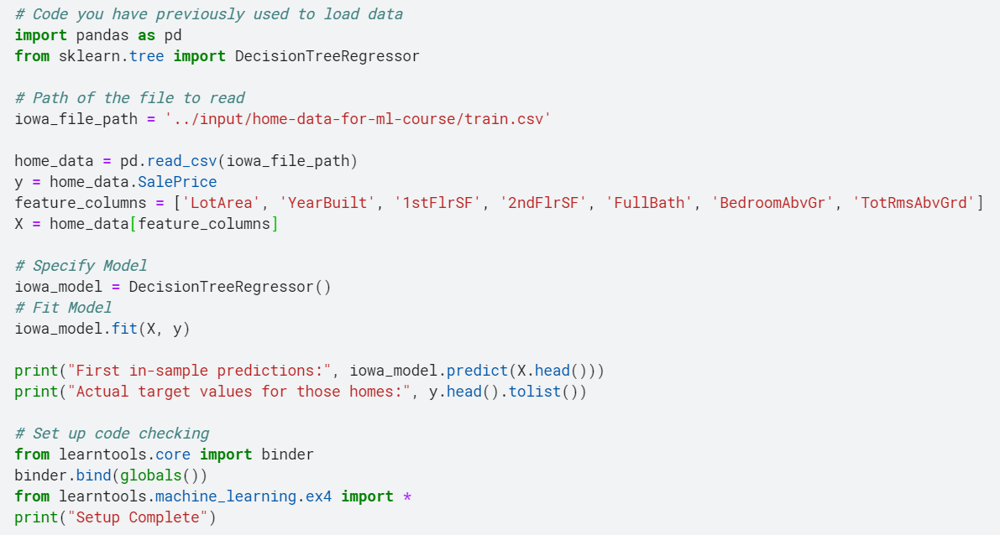

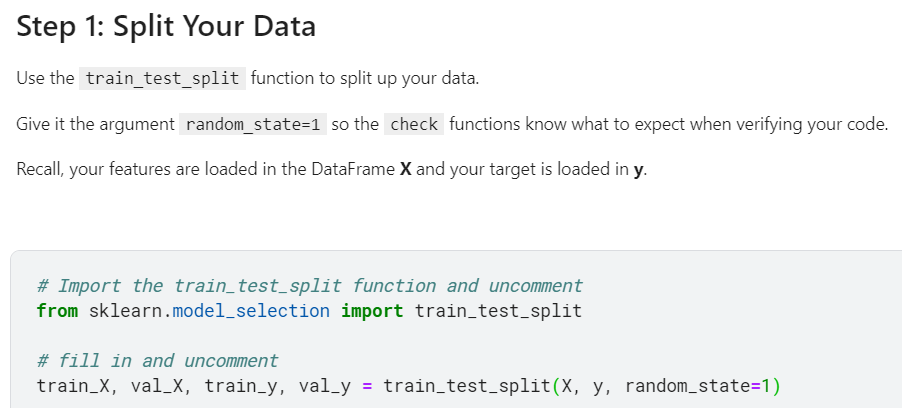

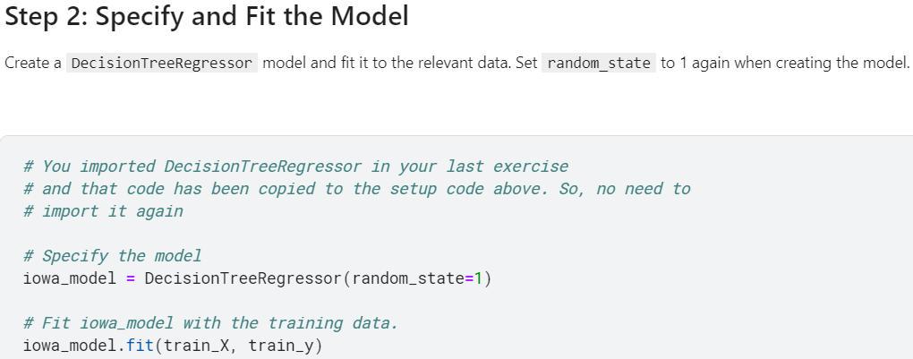

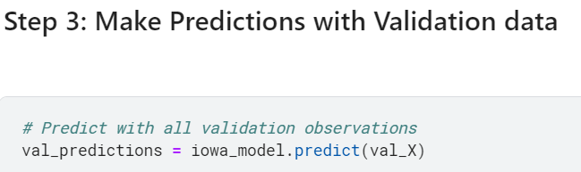

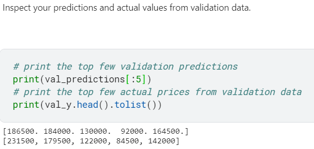

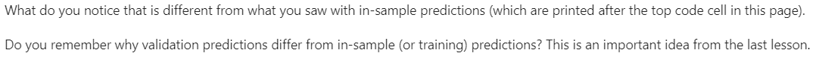

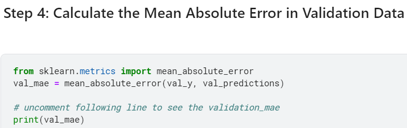

# 5) Underfitting and Overfitting

The most important options determine the tree's depth. A tree's depth is a measure of how many splits it makes before coming to a prediction.  

 

In practice, it's not uncommon for a tree to have 10 splits between the top level (all houses) and a leaf. As the tree gets deeper, the dataset gets sliced up into leaves with fewer houses. If a tree only had 1 split, it divides the data into 2 groups. If each group is split again, we would get 4 groups of houses. Splitting each of those again would create 8 groups. If we keep doubling the number of groups by adding more splits at each level, we'll have 210210 groups of houses by the time we get to the 10th level. That's 1024 leaves. 

When we divide the houses amongst many leaves, we also have fewer houses in each leaf. Leaves with very few houses will make predictions that are quite close to those homes' actual values, but they may make very unreliable predictions for new data (because each prediction is based on only a few houses). 

This is a phenomenon called overfitting, where a model matches the training data almost perfectly, but does poorly in validation and other new data. On the flip side, if we make our tree very shallow, it doesn't divide up the houses into very distinct groups. 

At an extreme, if a tree divides houses into only 2 or 4, each group still has a wide variety of houses. Resulting predictions may be far off for most houses, even in the training data (and it will be bad in validation too for the same reason). When a model fails to capture important distinctions and patterns in the data, so it performs poorly even in training data, that is called underfitting. 

Since we care about accuracy on new data, which we estimate from our validation data, we want to find the sweet spot between underfitting and overfitting. Visually, we want the low point of the (red) validation curve in 

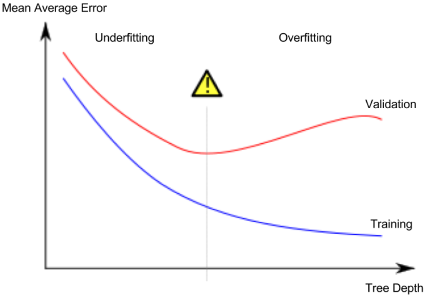


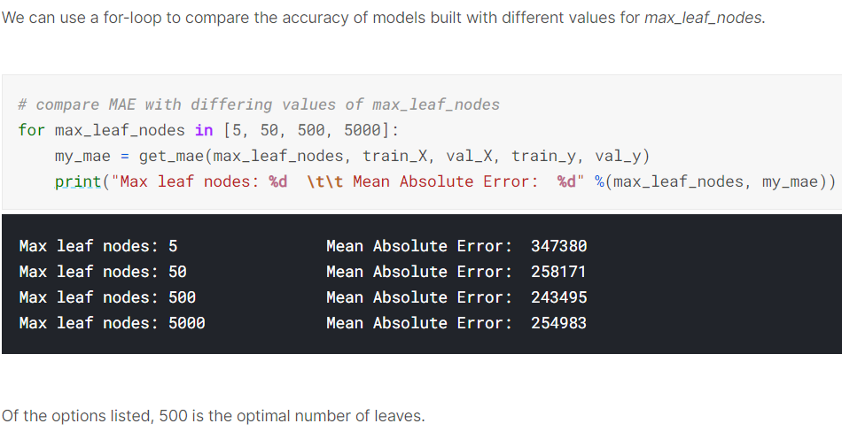

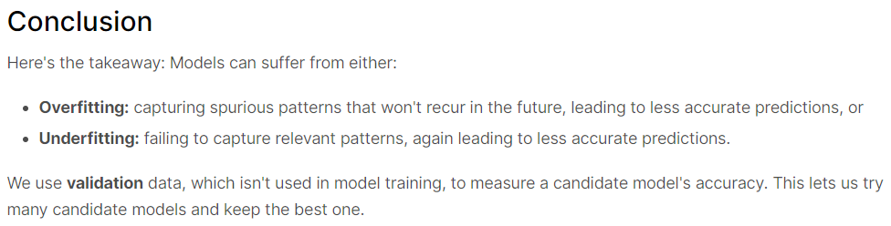

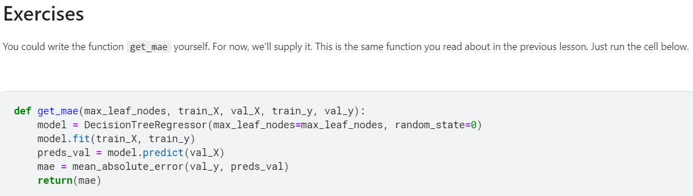

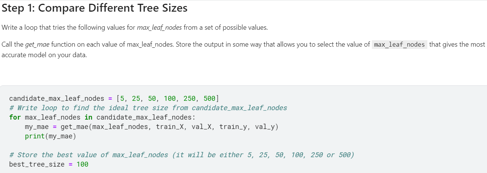

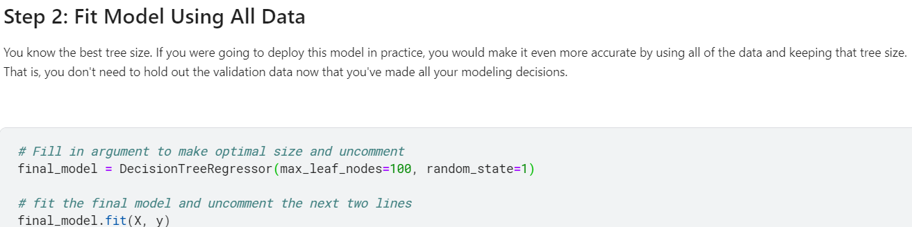

# 6) Random Forests

Decision trees leave you with a difficult decision. A deep tree with lots of leaves will overfit because each prediction is coming from historical data from only the few houses at its leaf. But a shallow tree with few leaves will perform poorly because it fails to capture as many distinctions in the raw data. 

Even today's most sophisticated modeling techniques face this tension between underfitting and overfitting. But, many models have clever ideas that can lead to better performance. We'll look at the random forest as an example. 

The random forest uses many trees, and it makes a prediction by averaging the predictions of each component tree. It generally has much better predictive accuracy than a single decision tree and it works well with default parameters. If you keep modeling, you can learn more models with even better performance, but many of those are sensitive to getting the right parameters.

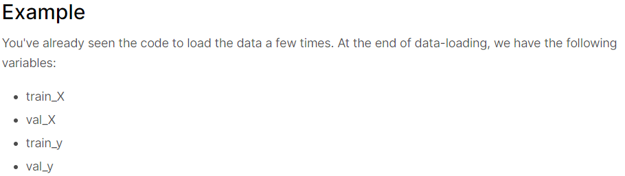

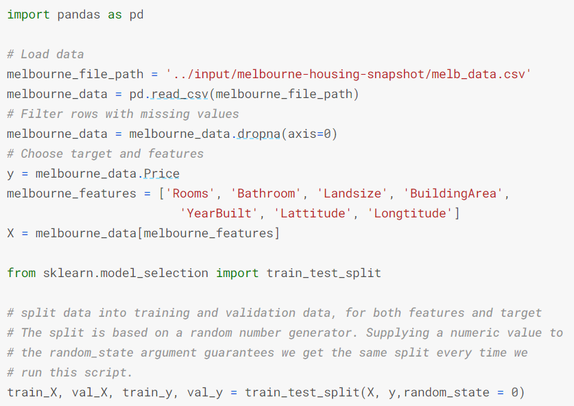


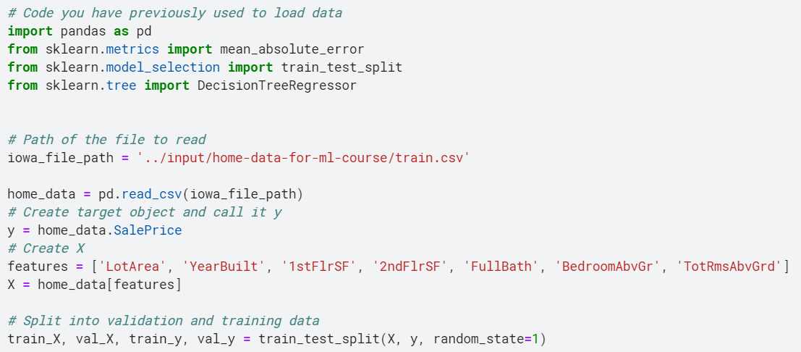


